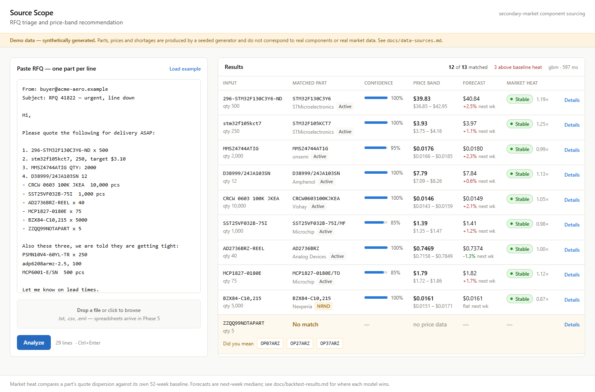
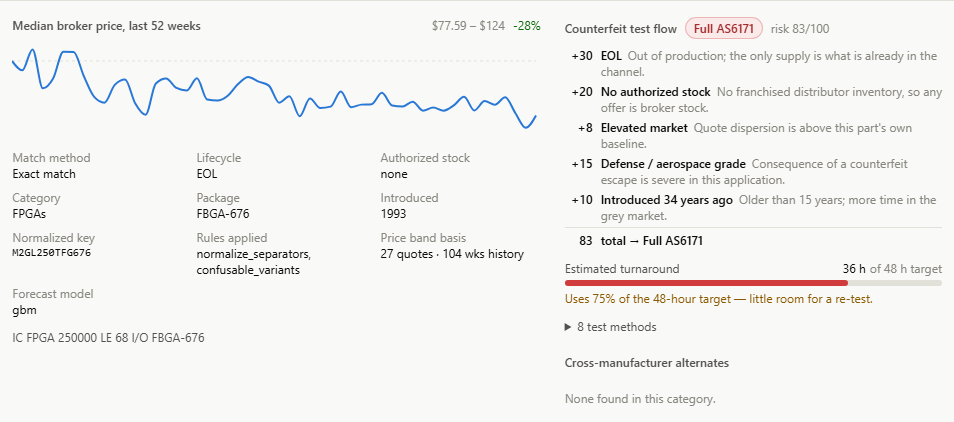

# PartScope

RFQ triage for the electronic-component secondary market: paste a messy
request for quote, get back matched parts, price bands, forecasts and
counterfeit-test recommendations.

> **Real parts, synthetic pricing.** The catalog is 6,286 real components from
> Mouser's Search API. All prices, forecasts and market-heat figures are
> generated and do not reflect real quotes. See
> [docs/data-sources.md](docs/data-sources.md).

**Live demo:** <https://www.partscope.online>
Login: `admin` / `pass` — public demo credentials, no sign-up needed.



Click any row to see the reasoning behind the match, price, and test-flow
recommendation:



---

## Quickstart

Requires Docker, Python 3.11+, Node 20+. No API keys or accounts needed.

```bash
git clone <this-repo> partscope && cd partscope
make setup     # deps + .env
make demo      # datastores up, data seeded, all services running
```

Open <http://localhost:5173> and click **Load example**.

On Windows, use `./make.ps1 setup` and `./make.ps1 demo` instead.

<details>
<summary>Individual targets</summary>

```bash
make up        # postgres + mongo
make seed      # generate synthetic dataset (~35s)
make verify    # validate seeded data
make dev       # ml-service :8000, api :3000, web :5173
make test      # python + node test suites
make clean     # remove containers and volumes
```

</details>

`make demo` seeds the synthetic catalog. To use the real Mouser-sourced
catalog instead, run these manual scripts with `MOUSER_API_KEY` set in `.env`:

```bash
python ml-service/seed_7_categories.py
python ml-service/generate_real_price_history.py
```

This replaces the synthetic catalog, so the matcher's test cases (which
reference generated part numbers) will no longer pass.

## The problem

Buying obsolete or allocated components from the secondary market is painful
for three reasons:

- **Identity is messy** — the same part shows up as `STM32F103C8T6`,
  `stm32f103c8`, a distributor SKU, or with a typo.
- **Pricing is chaotic** — no authorized anchor, so quotes for the same part
  vary wildly.
- **Authenticity is uncertain** — counterfeit testing is expensive, so
  deciding how much a part needs is a judgment call.

PartScope automates the first pass on all three.

## How it works

- **Input** — paste an email, upload a spreadsheet, or type part numbers
  directly. Columns and quantities are detected from content, not headers.
- **Matching** — normalizes messy input against a real parts catalog and
  scores confidence.
- **Pricing** — forecasts next-week price from historical broker quotes
  (gradient boosting beats naive and SARIMA baselines; see
  [docs/backtest-results.md](docs/backtest-results.md)).
- **Test-flow routing** — a transparent, rules-based score (lifecycle, stock,
  volatility, part grade, age, match confidence) recommends Standard,
  Enhanced, or Full AS6171 testing, with the reasons shown.


## Architecture

```
browser (React + Vite)
    |
Express API :3000 ── MongoDB   (parts catalog)
    |
FastAPI     :8000 ── PostgreSQL (price history, RFQs)
```

Two datastores because the data differs in shape: catalog specs vary by part
category, while price history is uniform time series. Details in
[docs/architecture.md](docs/architecture.md).

## Deployment

| Piece | Host | Configured by |
|---|---|---|
| React frontend | Vercel | `VITE_API_BASE_URL` |
| Express API | Render | `API_PORT`, `WEB_ORIGIN`, `AUTH_*` |
| FastAPI ml-service | Render (internal) | `ML_SERVICE_URL` |
| Parts catalog | MongoDB Atlas | `MONGO_URI`, `MONGO_DB` |
| Price history, RFQs | Neon Postgres | `POSTGRES_*` |

## Results

**Matcher** — measured on 60 hand-labelled cases against the synthetic
catalog (`make seed && make test`):

| Metric | Result |
|---|---|
| Top-1 accuracy | 96.0% |
| Top-3 accuracy | 100% |
| False-positive rate | 0.0% |

**Forecasting** — rolling-origin backtest, 500 parts, 37,500 predictions
(MAPE, lower is better):

| Segment | naive | sarima | gbm |
|---|---:|---:|---:|
| All parts | 6.5% | 6.8% | **5.3%** |
| During a shortage spike | 13.5% | 23.8% | **10.3%** |

Full methodology and commentary in [docs/backtest-results.md](docs/backtest-results.md).

## Data

| Dataset | Rows | Source | Real? |
|---|---|---|---|
| Parts catalog (deployed) | 6,286 | Mouser Search API | Real |
| Parts catalog (`make seed`) | 8,000 | seeded generator | Synthetic |
| Price history | ~2–3M rows | seeded generator | Synthetic |

Mouser publishes current distributor prices, not the weekly multi-broker
quote history this project needs, so all pricing remains generated — now keyed
to real part numbers. Full breakdown in
[docs/data-sources.md](docs/data-sources.md).

## What I'd do differently with real data

- Re-evaluate the matcher against real, human-labelled RFQ lines instead of
  60 hand-written cases.
- Expect the forecast gap to narrow — real shortages correlate across parts
  in ways the synthetic generator doesn't model.
- Add cross-sectional features (related parts, fab process) rather than
  relying on a part's own price history alone.
- Surface lead time as a first-class output — in a real shortage, "can I get
  it in time" often matters more than price.
- Calibrate the volatility flag against real outcomes (failed deliveries,
  counterfeit findings) instead of injected synthetic spikes.

## Project status

209 tests (164 Python, 45 Node) plus a TypeScript typecheck. `make test` runs
against the synthetic seed — see [Results](#results) for why.

Built in phases: data generators → matcher → pricing/forecasting → API layer
→ dashboard → parsing → test-flow routing → real catalog + auth + deployment.

## Licence

Personal portfolio project. Catalog data comes from Mouser Electronics'
public Search API and remains theirs; used here for non-commercial
demonstration only. Not affiliated with or endorsed by Mouser or any
manufacturer named in the catalog. All pricing shown is generated, not real
Mouser pricing.

## Development notes

Built with AI assistance. The architecture, data model, and technology
choices are mine, and I can explain the reasoning behind any part of this
codebase.
