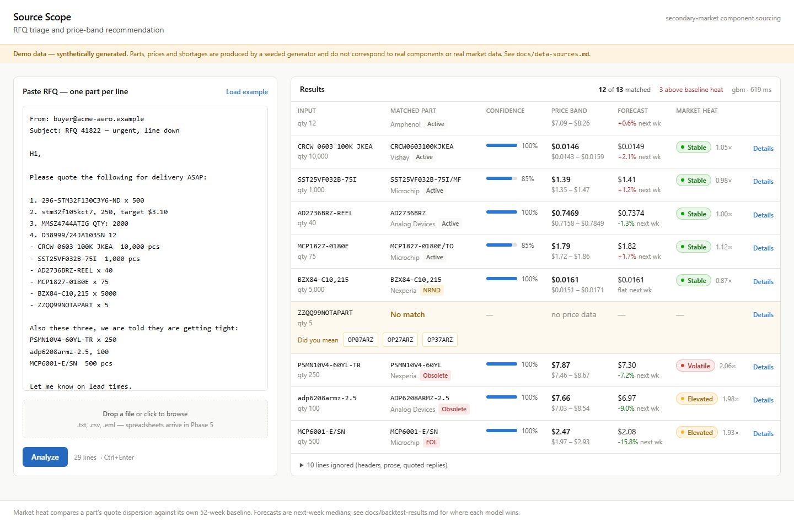

# Source Scope

RFQ triage for the electronic-component secondary market: paste a messy request
for quote, get back a clean sheet of matched parts, price bands, forecasts and
counterfeit-test recommendations.

> **Demo data — synthetically generated.** Every part and every price in this
> project is fabricated by a seeded generator. See
> [docs/data-sources.md](docs/data-sources.md).


Thirteen messy lines in, twelve matched, in about 600ms. The three parts at the
bottom of the table are the ones worth a buyer's attention — an obsolete power
FET and two end-of-life parts whose brokers have stopped agreeing on price:



---

## Status

Built in phases. This is what currently works:

| Phase | Scope | State |
|---|---|---|
| 0 | Scaffold, Docker datastores, synthetic data generators | **done** |
| 1 | Part matcher + accuracy evaluation | **done** |
| 2 | Pricing engine, forecasters, backtest | **done** |
| 3 | FastAPI + Express service layer | **done** |
| 4 | React dashboard | **done** |
| 5 | Email and spreadsheet parsing | not started |
| 6 | AS6171 test-flow routing | not started |
| 7 | Packaging and docs | not started |

## Quickstart

Requires Docker, Python 3.11+ and Node 20+.

```bash
cp .env.example .env      # defaults work as-is; no API keys needed
make setup                # venv + python deps + npm deps
make up                   # postgres + mongo via docker compose
make seed                 # generate the synthetic dataset
make verify               # prove the data has the properties we claim
```

On Windows, where `make` is not installed, the same targets are available as
`./make.ps1 setup`, `./make.ps1 up`, and so on.

## The problem

When a component goes obsolete or lands on allocation, authorized distributors
sell out and buyers move to the secondary market — independent brokers and
stockholders. Three things make that market painful:

- **Identity is messy.** The same physical part arrives as `STM32F103C8T6`,
  `stm32f103c8`, `296-STM32F103C8T6-ND`, or `STM32FI03C8T6` with an I for a 1.
- **Pricing is chaotic.** With no authorized anchor, cost tracks perceived
  scarcity. Identical parts get quoted hundreds of percent apart on the same day.
- **Authenticity is uncertain.** Counterfeit risk means lab testing against
  standards like AS6171, but a full test flow is expensive — so deciding how
  much testing a given part warrants is a judgement call.

Source Scope automates the first pass over all three.

## Architecture

```
browser (React + Vite)
    |
    v
Express API  :3000  ---- MongoDB   parts catalog (specs vary by category)
    |
    v
FastAPI      :8000  ---- PostgreSQL  price history, RFQs, line items
  matching / pricing / parsing / risk
```

Two datastores because the data genuinely differs in shape: `datasheet_specs`
is a different object for an op-amp than for a circular connector, while price
history is 2.8M uniform time-series rows that want window functions and
percentiles. Full rationale in [docs/architecture.md](docs/architecture.md).

## Matcher accuracy

Measured on 60 hand-written messy inputs in
[`ml-service/data/test_cases.json`](ml-service/data/test_cases.json) — 50 real
parts across nine kinds of mess, plus 10 deliberately non-existent parts that
must come back `no_match`. Reproduce with `make test`.

| Metric | Result |
|---|---|
| Top-1 accuracy | **96.0%** (48/50) |
| Top-3 accuracy | **100%** (50/50) |
| False-positive rate | **0.0%** (0/10 non-existent parts matched) |

| Case kind | n | Top-1 | Top-3 |
|---|---|---|---|
| exact | 7 | 100% | 100% |
| packaging suffix | 8 | 100% | 100% |
| truncation | 7 | 71% | 100% |
| typo | 7 | 100% | 100% |
| lowercase | 4 | 100% | 100% |
| whitespace | 4 | 100% | 100% |
| distributor prefix | 6 | 100% | 100% |
| O/0 confusion | 4 | 100% | 100% |
| I/1 confusion | 3 | 100% | 100% |
| non-existent (correctly rejected) | 10 | 100% | — |

**Both top-1 misses are truncations, and both are unresolvable.**
`SST25VF032B-75I` is a prefix of both `…-75I/MF` and `…-75I/SN`;
`MCP1827-0180E` is a prefix of three parts. The input does not contain the
information needed to choose, so the matcher returns all of them and the
correct part appears in the top 3. Making those score 100% would mean guessing,
and a confident wrong answer is worse here than an honest list.

Latency: ~13 ms per line to match, ~7 ms including alternates, against an
8,000-part in-memory index that takes 550 ms to build once at startup.

## Forecast accuracy

Rolling-origin walk-forward backtest: 500 parts, 25 origins, 37,500 predictions.
Train on weeks `0..t`, predict `t+1`, advance. Full commentary in
[docs/backtest-results.md](docs/backtest-results.md).

| Segment | `naive` | `sarima` | `gbm` |
|---|---:|---:|---:|
| All parts | 6.5% | 6.8% | **5.3%** |
| Active / NRND | 6.3% | 5.8% | **5.0%** |
| Obsolete / EOL | 6.7% | 7.8% | **5.5%** |
| **During a shortage spike** | 13.5% | 23.8% | **10.3%** |
| Normal weeks | 6.2% | 6.1% | **5.0%** |

MAPE; lower is better. Three results worth stating plainly:

- **The naive baseline is hard to beat.** A random walk wins 30% of part-weeks
  outright. On a stable part next week's price really is this week's price plus
  noise, and there is nothing there to model.
- **SARIMA has the best median error (4.7%) and the worst mean (6.8%).** It is
  better than naive most weeks and occasionally catastrophic — it reads a
  shortage spike as a trend and extrapolates while the price is already
  decaying. That is why it is not the default.
- **A seasonal term was selected for 0 of 500 parts.** Two years of weekly data
  is not enough to identify an annual cycle whose amplitude is smaller than the
  noise sitting on it, and AIC correctly declined to pay for one.

## Running it

```bash
make up && make seed     # databases + synthetic data (~35s)
make dev                 # ml-service :8000, api :3000, web :5173
```

Then open <http://localhost:5173> and press **Load example**.

The ML service trains its serving forecaster on first start (~70s) and caches
it; later starts take about 3 seconds.

Or drive it from the shell:

```bash
curl -X POST localhost:3000/api/rfq -H 'Content-Type: application/json' \
  -d '{"raw_text":"296-STM32F130C3Y6-ND x 500\nstm32f105kct7, 250"}'
```

### The dashboard

One page. Paste on the left, results on the right.

- **Confidence** renders as a bar; anything under 0.7 is tagged **Review**.
- **Market heat** is a chip — Stable / Elevated / Volatile — always carrying a
  dot *and* the word, never colour alone, because the amber step is deliberately
  below 3:1 against a white surface.
- **Clicking a row** expands it: a 52-week price sparkline, the normalisation
  rules that fired, lifecycle and stock, and cross-manufacturer alternates
  ranked by spec distance.
- **A line that matches nothing** turns amber and offers its three nearest
  misses as buttons; clicking one resolves that row in place rather than
  re-running and re-persisting the whole RFQ.
- **Lines the parser skipped** (headers, prose, quoted replies) are listed under
  the table. A line that silently vanished between the paste and the results is
  the one failure mode a buyer would never catch.

## Data

8,000 parts and ~2.8M weekly broker quotes, generated deterministically from one
seed. About a quarter of the catalog is Obsolete or EOL with zero authorized
stock — those are the interesting cases. Roughly 15% of parts carry an injected
shortage event whose quote dispersion widens sharply during the spike, which is
the signal the volatility flag reads.

**None of it is real.** Read [docs/data-sources.md](docs/data-sources.md) before
drawing any conclusion from a number this project prints.

## Licence

Personal portfolio project. Not affiliated with, endorsed by, or reviewed by any
manufacturer or distributor named in the generated data.
