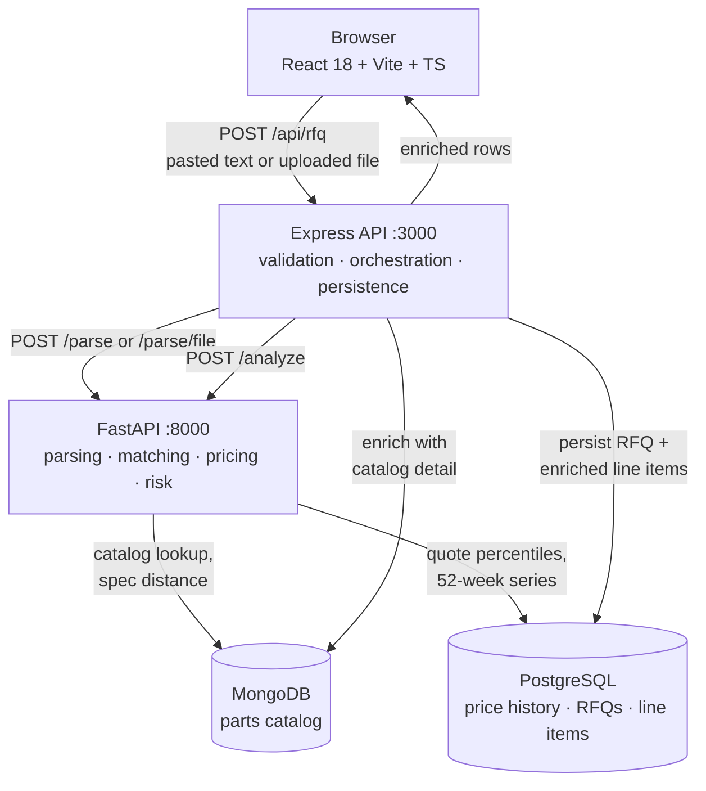

# Architecture

Three processes and two datastores. The interesting decisions are where the
line between the two services falls, and why the data is split across two
engines rather than one.

## Data flow



The same flow with the return path drawn in — nineteen steps from paste to
rendered row, showing which calls are batched and where the work actually
happens:


## Where the line falls

Express owns request validation, persistence and error shaping. FastAPI owns
everything with a model or an algorithm in it — parsing, matching, pricing,
risk.

That split is worth more than it looks. Because no analysis logic lives behind
the web tier, the whole pipeline is exercisable from `pytest` with nothing
running: 164 of the project's 209 tests never open a socket. It also meant that
when parsing outgrew its first implementation in Phase 5, there was exactly one
place to put the replacement.

The rule has one enforced consequence: **there is no second implementation of
anything on the Node side.** An earlier JavaScript RFQ parser was deleted rather
than kept in sync, because two answers to "what is a part number" drift, and the
drift surfaces as a line item the API reads one way and the matcher another.

## Request lifecycle

A `POST /api/rfq` with pasted text:

1. **Express** validates the body with `zod` and rejects anything malformed with
   `{ error: { code, message } }`.
2. **FastAPI `/parse`** turns the text into line items — headers, signatures and
   quoted reply chains stripped, quantities extracted.
3. **FastAPI `/analyze`** matches each line against an in-memory catalog index,
   loads every matched part's price history in **one** Postgres round trip, and
   returns bands, forecasts, heat and risk.
4. **Express** enriches the rows with full catalog documents from Mongo — again
   one query for the batch, not one per line — then writes the RFQ and its line
   items in a single transaction.
5. The enriched rows go back to the browser.

Fifteen messy lines complete this in roughly 700 ms.

Two caches make that possible, and both are deliberate:

- **Catalog index** — the entire catalog loaded into memory once at startup
  (~550 ms): 8,000 generated parts after `make seed`, or the 6,286 real ones in
  the deployed build. At either size an in-memory index beats a query per lookup
  by orders of magnitude, and it is what makes prefix and fuzzy matching
  affordable.
- **Serving forecaster** — the gradient booster takes ~70 s to fit and is
  cached to disk, keyed by a signature of the data and feature version. Without
  it every service start paid that cost; with it, startup is under 3 s. SARIMA
  keeps a separate per-part order cache, because its grid search is the
  expensive half and its answer barely moves week to week.

Both are filled by the FastAPI `lifespan()` hook, which is where the expensive
work is paid for once so that step 3 above touches no database at all:


## Why two datastores

This is the question a reviewer should ask, so here is the answer plainly.

### MongoDB — the parts catalog

Each part carries a `datasheet_specs` object whose **shape depends on its
category**:

```jsonc
// an op-amp
{ "channels": 2, "gbw_mhz": 22.0, "slew_rate_v_us": 13.5, "input_offset_uv": 25 }

// a MIL-spec circular connector
{ "shell_size": 20, "contact_count": 13, "contact_gender": "Pin",
  "mil_spec": "MIL-DTL-38999 Series III", "mating_cycles": 500 }
```

Thirteen categories with disjoint attribute sets. Relationally that is a wide
sparse table, an EAV join, or thirteen sibling tables — all three of which cost
more than they return here, because the access pattern is *fetch the whole spec
object for one part* and *compare spec objects within a category*. Phase 1's
alternate-parts ranking reads every numeric field at once to compute a weighted
distance, so there is nothing to gain from splitting the object into columns.

Document storage also means adding a category later is a generator change, not a
migration.

### PostgreSQL — price history and RFQs

The pricing data is the opposite shape: ~2.8M rows of a single uniform schema
(`part_mpn`, `week_start`, `broker_id`, `quoted_price`, `quoted_qty`,
`lead_time_days`), queried with percentiles and window functions.

`percentile_cont(0.25) WITHIN GROUP (ORDER BY quoted_price)` grouped by part and
week *is* the price-band feature, computed in the database over a covering index
rather than pulled into application memory. The volatility flag is the same
aggregate compared against its own 52-week baseline. That is exactly what a
relational engine is for.

RFQs and their line items live here too, because they are genuinely relational —
a line item belongs to one RFQ, with a foreign key and a cascade — and because
persisting an analysis alongside the price data it was derived from keeps the
audit trail in one place.

## Repository layout

```
ml-service/     Python: FastAPI service, generators, models, tests
  app/          config, main.py
    matching/   normalisation rules, match cascade, alternates
    pricing/    repository, bands, volatility, forecasters, backtest
    parsing/    token scoring, email parser, spreadsheet parser
    risk/       AS6171 test-flow rules
  data/         generate_catalog.py, generate_price_history.py, test_cases.json
  notebooks/    backtest_report.ipynb
api/            Node/Express: routes, db access, migrations
  src/db/migrations/   001_init.sql
web/            React + Vite dashboard
scripts/        seed, verify, wait-for-db, dev runner, backtest, build_samples
sample-rfqs/    a messy email and two BOM spreadsheets
docs/           this file, data-sources.md, backtest-results.md
```

`scripts/` holds the cross-platform entry points; the `Makefile` and `make.ps1`
are thin wrappers over them so the same commands work on macOS, Linux and
Windows.

## What is deliberately absent

No multi-tenancy, no message queue, no container orchestration. This is a
single-user analysis tool, and every one of those would be weight without a
load. The two datastores are here because the data genuinely has two shapes;
nothing else was added on the same reasoning.

Authentication is the one thing the public deployment forced, and it was kept
to the same standard. There is one account, `AUTH_USER` and `AUTH_PASSWORD` in
`.env` — no user table, no signup, no reset, because there is nothing to
enumerate. Proof of login is a signed token rather than a row in a session
store: `base64url(claims).base64url(hmac)`, HMAC-SHA256 over the claims, which
`node:crypto` and Express's own `res.cookie` cover between them with no new
dependency and no third datastore. The trade is that a single token cannot be
revoked on its own — changing `AUTH_USER` or restarting invalidates every
outstanding one, which for a one-account tool is the only revocation anyone
would ask for. Leaving both variables blank turns the gate off entirely, so a
clean clone still runs with no configuration.
