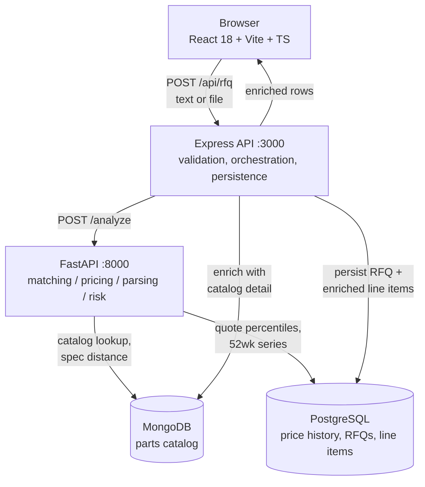

# Architecture

> Expanded in Phase 7. This is the shape as of Phase 0, and the reasoning behind
> the datastore split, which is the decision worth explaining early.

## Data flow



The Express layer owns request validation, persistence and error shaping; the
FastAPI layer owns everything with a model or an algorithm in it. Splitting on
that line means the Python service stays a pure analysis service that can be
exercised directly from `pytest` without a web tier in the way.

## Why two datastores

This is the question a reviewer should ask, so here is the answer plainly.

### MongoDB — the parts catalog

Each part carries a `datasheet_specs` object whose **shape depends on its
category**:

```jsonc
// an op-amp
{ "channels": 2, "gbw_mhz": 22.0, "slew_rate_v_us": 13.5, "input_offset_uv": 25 }

// a MIL-spec circular connector
{ "shell_size": 20, "contact_count": 13, "contact_gender": "Pin",
  "mil_spec": "MIL-DTL-38999 Series III", "mating_cycles": 500 }
```

Thirteen categories with disjoint attribute sets. Relationally that is a wide
sparse table, an EAV join, or thirteen sibling tables — all three of which cost
more than they return here, because the access pattern is *fetch the whole spec
object for one part* and *compare spec objects within a category*. Phase 1's
alternate-parts ranking reads every numeric field at once to compute a weighted
distance, so there is nothing to gain from splitting the object into columns.

Document storage also means adding a category later is a generator change, not a
migration.

### PostgreSQL — price history and RFQs

The pricing data is the opposite shape: ~2.8M rows of a single uniform schema
(`part_mpn`, `week_start`, `broker_id`, `quoted_price`, `quoted_qty`,
`lead_time_days`), queried with percentiles and window functions.

`percentile_cont(0.25) WITHIN GROUP (ORDER BY quoted_price)` grouped by part and
week *is* the price-band feature, computed in the database over a covering index
rather than pulled into application memory. The volatility flag is the same
aggregate compared against its own 52-week baseline. That is exactly what a
relational engine is for.

RFQs and their line items live here too, because they are genuinely relational —
a line item belongs to one RFQ, with a foreign key and a cascade — and because
persisting an analysis alongside the price data it was derived from keeps the
audit trail in one place.

## Repository layout

```
ml-service/     Python: FastAPI service, generators, models, tests
  app/          config, service, matching/ pricing/ parsing/ risk/
  data/         generate_catalog.py, generate_price_history.py, test_cases.json
api/            Node/Express: routes, db access, migrations
web/            React + Vite dashboard
scripts/        seed, verify, wait-for-db, dev runner
docs/           this file, data-sources.md, backtest-results.md
```

`scripts/` holds the cross-platform entry points; the `Makefile` and `make.ps1`
are thin wrappers over them so the same commands work on macOS, Linux and
Windows.
